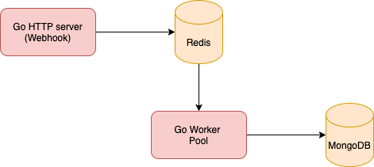

# Go Worker Pool POC

A simple POC using `docker-compose` to learn [go worker pools](https://gobyexample.com/worker-pools).

#### Architecture
REST calls to the app results in messages getting inserted into a [Redis hash](https://redis.io/topics/data-types#hashes).  
The workers in the pool pickup messages, process them and send response events to a stream.

#### To run
`docker-compose up`

#### Running tests
